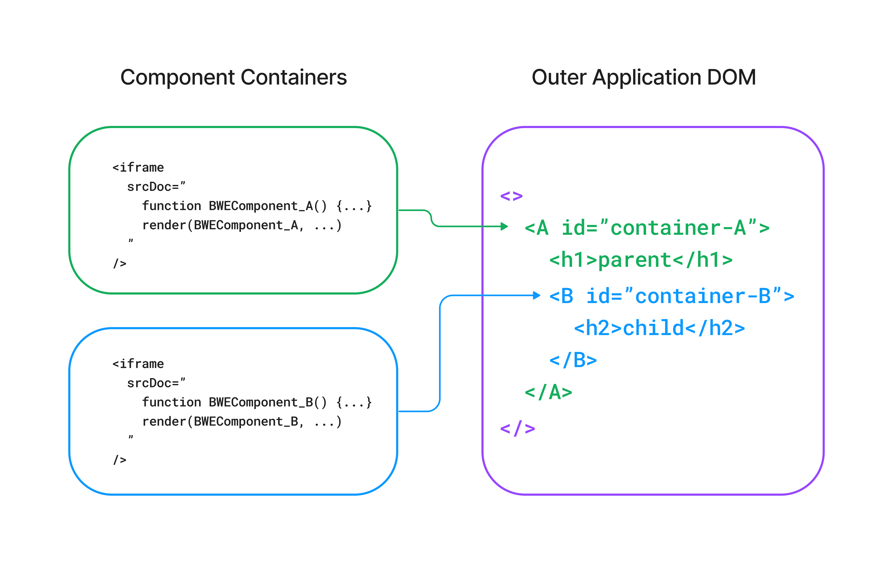
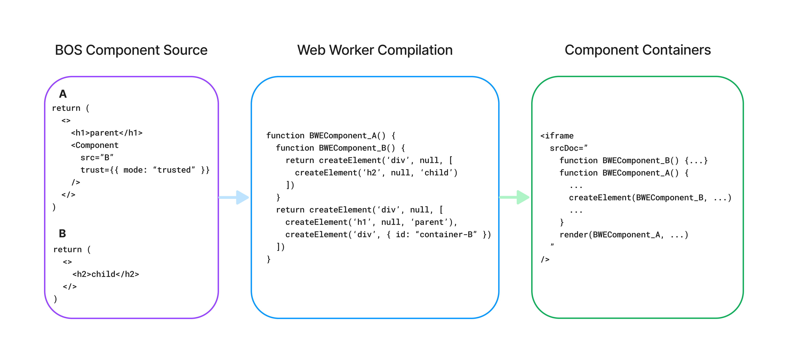

# BOS Web Engine Architecture

## Overview

BOS Web Engine is a framework for creating secure JavaScript environments for BOS Components backed by iframes. This offers
risk-free composability while supporting basic React Components, a growing set of APIs, and ultimately NPM dependencies.

### BOS Component Loading
BOS Components are loaded in BOS Web Engine by way of a client-side pipeline, responsible for BOS Component source
fetching, JSX transpilation, and Component composition. A web worker services requests from the outer application to
load new Components, caching the Component source and transpiled wrapper function. The worker responds with the wrapped
source code, which is used to initialize containers with iframes.

_High-level overview of the flow from BOS Component source to Component container._

### Component Containers
Containers are abstractions around sandboxed iframes, responsible for managing the lifecycle of a single root Component.
The outer application renders a container for each root Component, rendering the container's hidden iframe and executing
the container code in the iframe's `srcDoc` field.

Containers rely on Preact for Component lifecycle management. When a Component has updated, options hooks set in Preact
serialize the rendered node and send it to the outer application. The initial render request is explicitly triggered upon
container initialization. This Preact integration enables the use of React hooks within BOS Components.

Interactions between containers are facilitated by the iframe parent's _window_ object, e.g. `window.parent.postMessage()`. 
The outer application and individual containers register event handlers on this _window_ object to facilitate bidirectional
message passing to communicate renders and broker inter-Component callbacks. As a consequence of this, all inter-Component
communication is inherently asynchronous.

_Component containers manage root Components, which may be under another Component in the DOM tree despite being sandboxed._

### Trust
Component Trust ensures that BOS Components retain control over composability with other Components. When rendering a BOS
Component in Web Engine, the **trust mode** determines how to load the Component:
- **trusted** loads the Component inside the same container
- **sandboxed** loads the Component as a root Component in a new container

Trust mode does not impact the rendered output in the outer application, but has implications for performance and security.
In particular:
- Trusted Components invoke methods directly within the same context. Sandboxed Components are subject to performance overhead
inherent in proxying callbacks through the outer application.
- Sandboxed Components are loaded dynamically, and their paths do not need to be known at build time. Trusted Components
incur a loading penalty upfront when fetching and parsing source for multiple Components, and must use statically-analyzable
paths to guarantee all Components are known at build time.
- Sandboxed Components run in their own sandboxed iframe container and may only communicate with other containers using a
well-defined message passing interface. Trusted Component trees run in the same context, with access to the same references.

Component Trust is best employed to create logical trust boundaries in a BOS application, for instance between Components
from different accounts. By default, BOS Components are loaded as **sandboxed**; loading a Component as **trusted** requires
explicit configuration.

_Trusted Components are included in the same container context as their parent Component._

### Component Callbacks
Callbacks between Components (e.g. functions passed via `props`) are supported in BOS Web Engine, though the exact behavior is
dependent on whether the Components are within the same container. Callbacks between two Components _in the same container_
work without constraints, but there are caveats for callbacks _between containers_ as the caller and callee exist in completely
independent contexts. Under the hood, these inter-container callbacks must be invoked (and return data) using the message passing interface
provided by `window.postMessage`, and are subject to some constraints accordingly:
- Arguments may only use types compatible with the [structured clone algorithm](https://developer.mozilla.org/en-US/docs/Web/API/Web_Workers_API/Structured_clone_algorithm).
While functions cannot be provided as arguments directly, references to callbacks in other containers may be passed, allowing
BOS Components to invoke functions on `props` with function arguments.
- Inter-container callbacks are inherently asynchronous, for which a Promise-based interface is provided to abstract away
the underlying event-based communication.

This inherent asymmetry presents a challenge to BOS Component developers, who must now contend with two different return
types entirely contingent on how their Component is consumed. To unify this interface, the current implementation provides
an optional `useComponentCallback` hook returning a higher-order function to be invoked instead of invoking the callback
directly.
